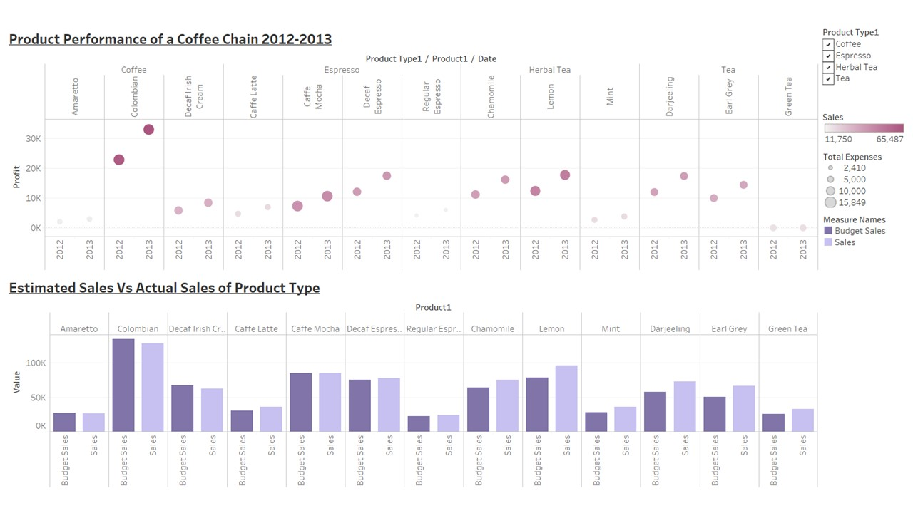

# Analyzing Consumer Trends for Leading Coffee Chain Houses in the U.S.A

## Project Description:
Create a data visualization that explores the coffee dataset. In this we analyzed consumer trends for leading coffee chain houses in the U.S.A.

## Objectives/Problem Statements:
1. Surveying the share of coffee drinking consumers in the united states in 2018 by age group.
2. State wise sales Performance of beverages.
3. Reviewing the share of beverages consumption in the U.S for 2018.
4. Analyzing the product performance of coffee chain in 2012-2013.
5. Comparing actual sales to the estimated values for beverages across coffee chains.
6. Analyzing the share of Americans visiting Dunkin Donuts for 2018.
7. Analyzing the share of Americans visiting Starbucks for 2018.

## Dataset Description:
We have used 6 datasets.

1. **Coffee dataset:** The dataset describes different products and their types that are commonly sold in the U.S Markets. The dataset has 20 variables and 4249 observations. 
2. **Coffee drinking US consumers by age group**.
3. **Types of beverage consumption share in the US**. (performed Data Cleaning by calculating the total shares for each beverage type).
4. **Sales of leading coffee chain houses in the US**.
5. **Share of Americans visiting leading coffee chain houses in US:** Combing common age groups for Dunkin Donuts and Starbucks to obtain two different data sets for share of visiting Dunkin Donuts and Starbucks each.

## Results:
* By surveying the share of coffee drinking consumers in the US in 2018 by age group we found that people of age group 60years and above were the highest consumers of coffee.
* By Analyzing the sales of beverages across states we found that:
1.	Massachusetts recorded highest Profits of coffee by coffee chains in 2012-2013.Nevada contributes lowest towards coffee sales profits.
2.	On the contrary espresso profits are seen at the highest in California and Illinois, but New Hampshire records a loss for espresso sales.
3.	Unlike coffee and espresso Herbal Tea is the more profit-making beverage across many states of US with California, Nevada, Iowa, Illinois contributing towards major profit share while New Hampshire bears losses for the beverages.
4.	Iowa is a biggest contributor towards the tea profits while Utah is the least.
* By surveying the Beverage consumption in the united states for 2018 we found that coffee consumption was at the highest by 45% and 40% of the consumers preferred Espresso and the remaining preferred Tea.
* Product performance of coffee chain for 2012-2013. The darker the color the better the sales. Sales wise Columbian coffee is the highest while Lemon herbal tea is the second highest while regular espresso is the least sold beverage for year 2012-2013.
*	Comparing the size of the markups Columbian coffee incurs highest expenses and regular espresso contributes to lowest total expenses.
*	While analyzing the estimated sales Vs actual sales of the product types we found that Columbian coffee projected highest variance between its budgeted sales Vs actual sales for the year 2012-2013, on the contrary lemon herbal tea recorded higher sales as compared to its budgeted sales in the year 2012-2013.
*	We also audited the market shares of the leading coffee chain houses on the basis of their sales in the US and we found that Starbucks dominated the market with $17.65 billions of sales. Dunkin Donuts competing with Starbucks with $8.46 billion sales and Panera bread contributed to the third highest with the sales of $5.47 billion.
*	On this basis we surveyed different age groups of Americans visiting Dunkin Donuts and Starbucks and we found that Dunkin Donuts was more popularly visited by consumers of age group 30-49 years while Starbucks was the favorite of Americans between age groups 18-29 years.

## Conclusion:
In conclusion, we studied the market of coffee chains in the U.S. The findings and recommendations that follow from our analyses are summarized here.

When exploring the overall coffee consumers in the U.S as per their age group, we found that people in the age group 60 and above were the highest consumers of coffee. On the contrary, we found that Starbucks had visitors in the age group of 18-29 years, while people in the age group of 30-49 years preferred Dunkin’ Donuts. There can be many factors behind the variation of coffee choices amongst age group, like- Starbucks must have chains more accessible to the college campuses becoming a favorite place for young crowds, or the choice of coffee that Starbucks offered to attract the young generation. Whereas, if people from 30-49 age prefer Dunkin’ Donuts leads us to questions like- are these chains located in the proximity of work places more than other chains, is the choice of beverages offered targets to this age group, or even the pricing of the products sometime may be taken into consideration. Thus, a recommendation can only be offered considering these points too.

We also investigated the top preferences of beverages sold by a coffee chain, and we found that Coffee was the number one preference followed by espresso and then tea. To see the dynamics of these products across the states of U.S we plotted the profits of the coffee chain product wise across the map. Our analysis provided insight to the diversity of choices across the different states. Coffee drinks is highly preferred in Massachusetts while Nevada do not. The coffee chain scored profits from California and Illinois but was in losses in New Hampshire for Espresso drinks. On the contrary Iowa consumed tea more than any other states. But only on the basis of these data, it is hard to conclude what the population of the states preferred. Factor like- other coffee houses competing this coffee chain, people preferred their beverages from other joints, location of the considered coffee chains, age-group of the visitors visiting the coffee chain, ethnicity of the visitors visiting the coffee chain; must also be considered before making any decisions
These hints should provide sufficient resource for decision makers to consider other factors affecting their sales too.        

